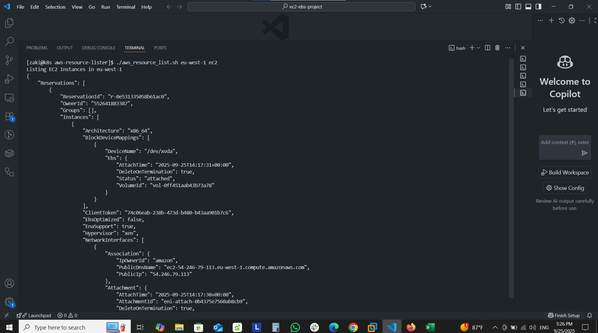
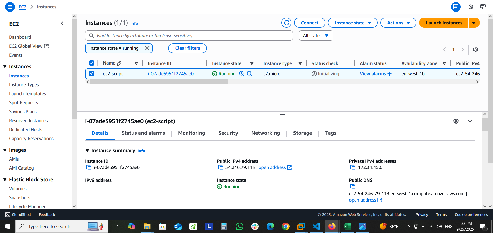

# 🚀 AWS Resources Lister 
A **Bash script** to automate listing of AWS resources across multiple services.  
Useful for auditing, compliance, cost optimization, and quick visibility into an AWS account.
---
## ✨ Features
- Supports **15+ AWS services** (EC2, RDS, S3, Lambda, Route53, CloudFront, etc.)
- Outputs results in **JSON format**
- Validates AWS CLI installation and configuration
---
## 📋 Prerequisites
- Linux/MacOS (or WSL on Windows)
- [AWS CLI v2](https://docs.aws.amazon.com/cli/latest/userguide/install-cliv2.html)
- AWS credentials configured:
  ```bash
  aws configure
  ```
## ⚡ Usage
   ```bash
   chmod +x aws_resource_list.sh
   ./aws_resource_list.sh <aws_region> <aws_service>
   ```
- Example
   ```bash
   ./aws_resource_list.sh us-east-1 ec2
   ```
## 🛠 Supported Services
- ec2 → EC2 Instances

- rds → RDS Databases

- s3 → S3 Buckets

- cloudfront → CloudFront Distributions

- vpc → Virtual Private Clouds

- iam → IAM Users

- route53 → Route53 Hosted Zones

- cloudwatch → CloudWatch Alarms

- cloudformation → CloudFormation Stacks

- lambda → Lambda Functions

- sns → SNS Topics

- sqs → SQS Queues

- dynamodb → DynamoDB Tables

- ebs → EBS Volumes

## 📸 Examples
- EC2 Output:

- EC2 GUI:


## 📂 Project Structure
```text
aws-resource-lister/
│── README.md
│── aws_resource_list.sh 
│── examples/
│ ├── ec2_gui.png
│ ├── ec2_output.png
│ ├── vpc_gui.png
│ ├── vpc_output.png
```
## ✅ Use Cases
- Infrastructure auditing
- Security/compliance checks
- Cost optimization (finding unused resources)
- Learning AWS CLI automation


   
